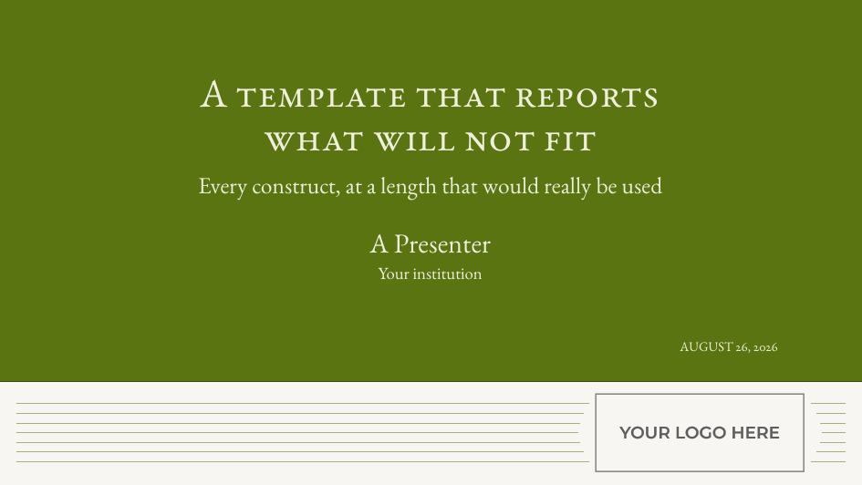
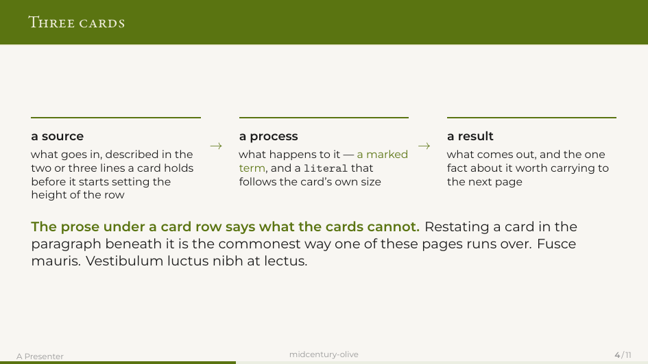
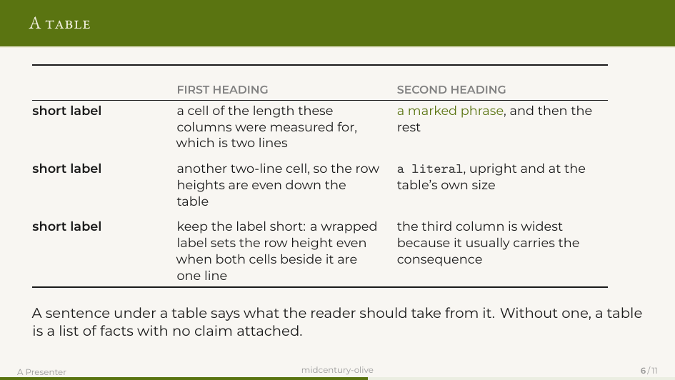
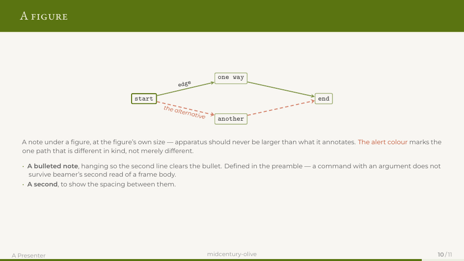
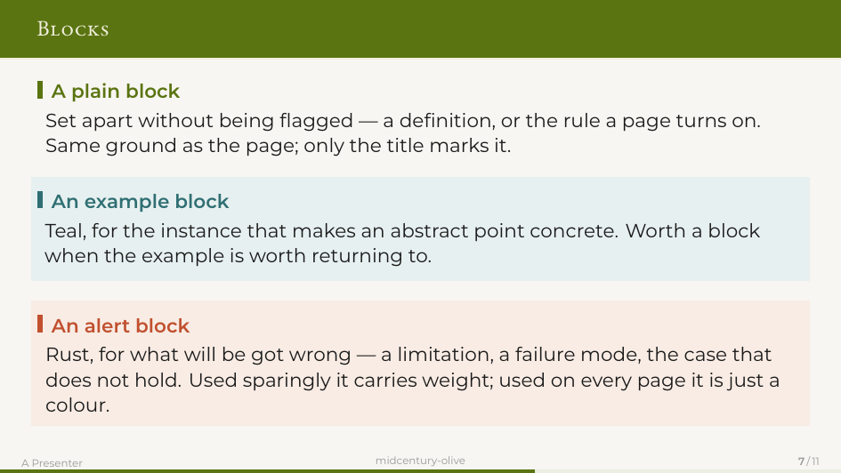
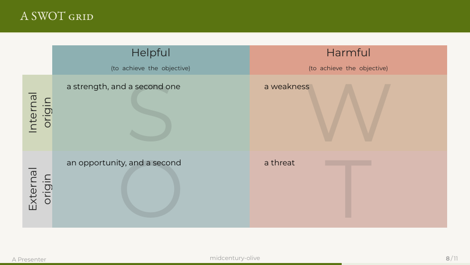
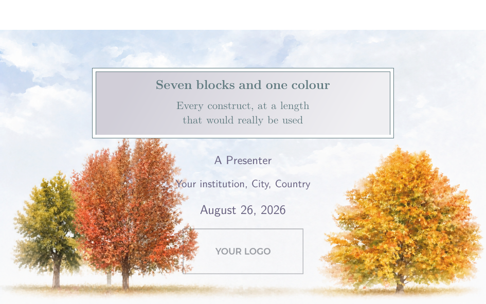
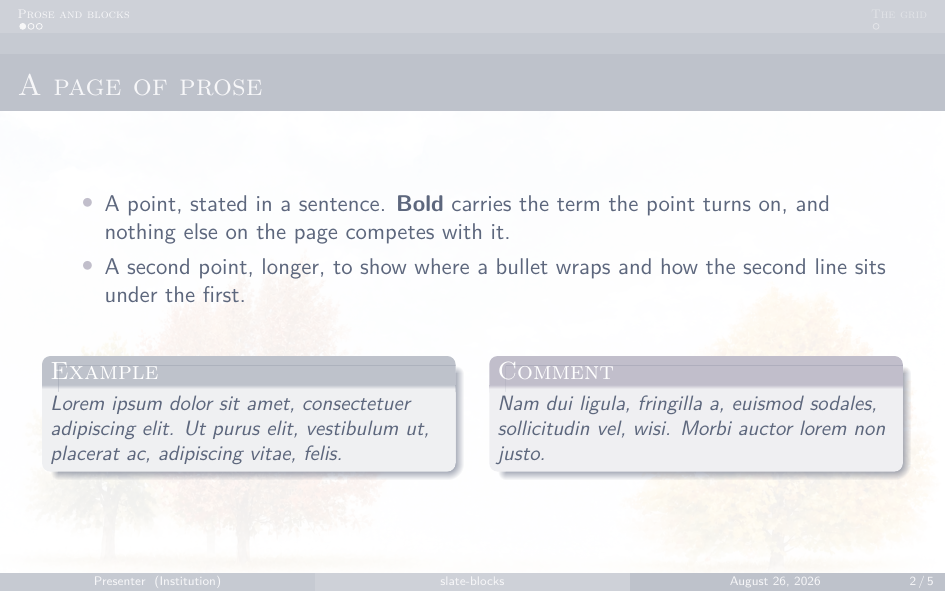
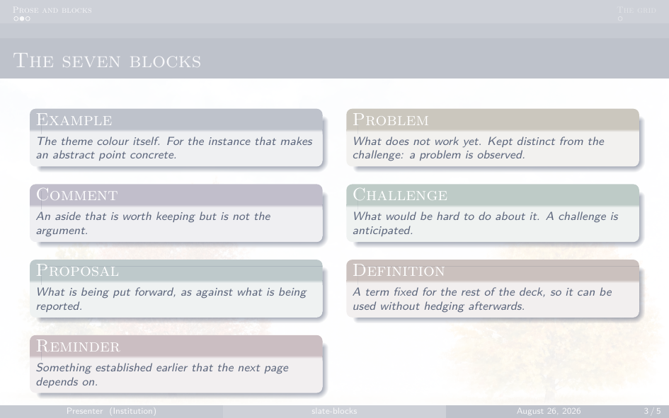
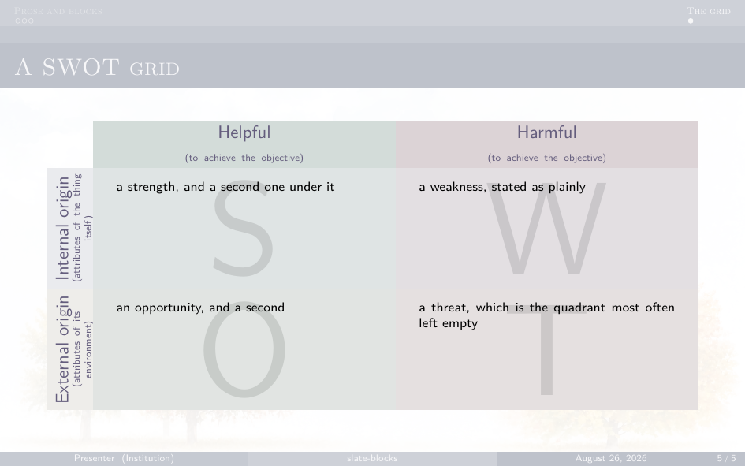

# Beamer templates

Presentation templates, one directory each, kept because each one was carried
through a real deck rather than admired on a gallery page. The point of the
collection is to have something to choose between.

Each directory stands alone: its own `slides.tex`, its own fonts, its own
`check.sh`, its own `README.md`, **its own `LICENSE`**. Copy one, do not try to
combine two.

## What is here

| | | |
|---|---|---|
| [`midcentury-olive/`](midcentury-olive/) | XeLaTeX · EB Garamond + Montserrat · olive green | A quiet, typographic 16:9 deck. Small-caps frame titles on a full-bleed band, card rows, section dividers with a subtitle. Built for a 45-page proposal defence. |
| [`slate-blocks/`](slate-blocks/) | pdfLaTeX or XeLaTeX · stock fonts · slate blue-grey | A 16:10 deck on stock beamer themes, with a photographic cover and seven named blocks in place of beamer's three. Every colour derived from one. |

Both carry the same `\swot` grid, each in its own palette.

**midcentury-olive**

<p align="center">
  
  <br>
  
  <br>
  
  
</p>

**slate-blocks**

<p align="center">
  
  <br>
  
  
</p>

## Every template ships a demo

`slides.tex` is the skeleton you copy — deliberately sparse, so it passes
whatever you do to the style and tells you nothing.

`demo.tex` is the same template with every construct filled to a length that
would really be used, the prose supplied by `\lipsum`. Build it after editing
anything in `tdstyle.tex`: uniform filler is what makes an uneven page the
template's fault rather than the writing's. The screenshots above come from it.

```
./check.sh          build slides.tex
./check.sh demo     build demo.tex
```

## What every template here has to do

These are the rules the collection is kept to. A template that cannot meet them
is not worth the trouble of keeping.

**Report, never shrink.** If a slide holds more than the frame does, the build
says so and names the frame. It does not scale the content down to fit — that is
the behaviour these were written to get away from, because it silently produces
a deck whose type size changes from page to page.

**Build with one command, twice.** `./check.sh`. Two passes, always: anything
positioned with `remember picture` needs the previous pass's `.aux`, and a
one-pass build leaves those pages blank without complaining.

**Bundle the fonts, load them by filename** — or use none at all. A font that is
not installed is substituted in silence, and a deck that looked fine on one
machine is set in Helvetica on another. Loading by fontconfig family name also
loses OpenType features — `smcp` in particular — with no warning.
`slate-blocks/` sidesteps this by staying on the stock faces; `midcentury-olive/`
carries its two in `fonts/`.

**Carry its own licence, and its upstream's.** Most of these start from someone
else's theme. The obligation travels with the files, so the licence lives in the
template directory, not only here.

**Write down what went wrong.** Each `README.md` has a section of traps that
cost a build or a wrong render, with the symptom, not just the fix. That section
is the most valuable part of the directory and the reason to keep it rather than
start again.

## No logos

None of these ships an institution's logo. A mark is its owner's trademark and a
licence on the surrounding files does not extend to it. Each template has a
placeholder; each `README.md` says what to re-measure after you replace it.

## Overleaf

Overleaf compiles these as they are — the fonts are in the repository and are
loaded by path, so there is nothing to install. Two settings, once per project,
under *Menu*:

* **Compiler: XeLaTeX** — required for `midcentury-olive/`. The default is
  pdfLaTeX, which cannot load an OpenType font by filename and will fail on the
  first `\setsansfont`. `slate-blocks/` builds under either.
* **Main document:** `midcentury-olive/slides.tex` or `slate-blocks/slides.tex`,
  or the `demo.tex` beside it to see the template filled in.

The quickest route in is *New Project → Import from GitHub*, which keeps the
link so a later `git push` shows up there. Uploading a zip works too and does
not.

What you lose on Overleaf is `check.sh`: it reads the log and tells you which
frame overflowed. Overleaf will still compile a deck whose slides are too full
without saying so — the warnings are in *Raw logs*, under a heading you have to
go looking for. If you draft there, build locally before you present.

## Licences

They differ per template, because the themes underneath come from different
places. See the `LICENSE` inside each directory. The fonts carry their own, in
`fonts/`, and are redistributed unmodified.
