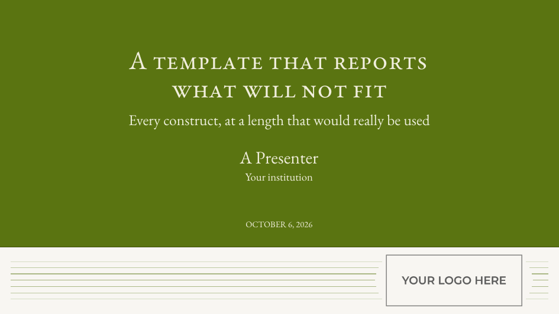
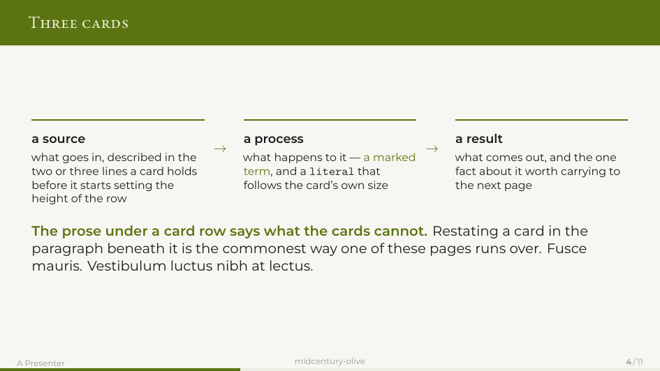
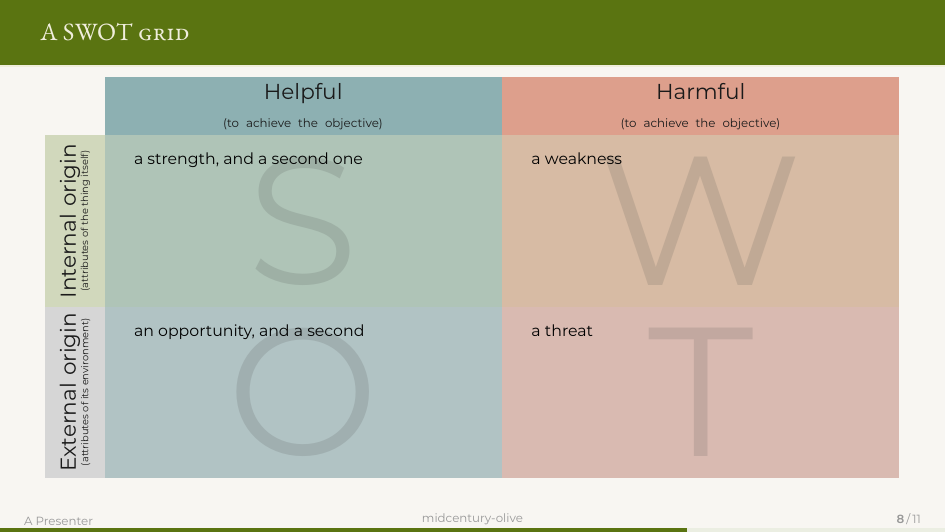

# midcentury-olive

A 16:9 beamer theme in one olive green, with small-caps frame titles on a
full-bleed band, card rows for a process, section dividers that take a
subtitle, and a SWOT grid whose quadrant colours are mixed from its two axes.
Built on Jules Leguy's *midcentury modern*.



**XeLaTeX only**, despite what the `.sty` header says — that line is upstream's
and this directory retargets it. The fonts are OpenType and loaded by path,
which means `fontspec`.

## Quick start

Copy this directory, then:

```
./check.sh          build slides.tex, report any frame that overflows
./check.sh demo     build demo.tex — every construct, filled out
./check.sh --clean  remove build artefacts
```

Write your deck in `slides.tex`. The preamble loads the theme, then the
additions:

```latex
\usepackage{beamerthememidcenturymodern}
\input{tdstyle}
\oliveTheme
```

Run the build **twice**. Section and study dividers are drawn with
`remember picture, overlay`, whose coordinates come from the previous pass's
`.aux`; one pass leaves them blank. `check.sh` does this for you.

Also on the Overleaf gallery. The "Open in Overleaf" button in the
[repository README](../README.md) opens the current release as a new project.

## What it gives you

| | |
|---|---|
| `\ac{...}` | a term, in the accent colour |
| `\acb{...}` | a named thing — a standard, a tool, a study — accent and bold |
| `\code{...}` | a literal. Follows the ambient size, always upright |
| `\aside{...}` | a note at the foot of a frame, above a hairline rule |
| `\slidelead{...}` | a frame's opening line, under the title band |
| `stepflow` / `\stepcard` / `\steparrow` | a card row. `\stepcard[w]` takes a width multiplier; the multipliers in a row should sum to the card count |
| `\tdsection{title}{subtitle}` | a section divider |
| `\tdstudy{label}{title}{body}` | a divider *inside* a section — thin spine, no page-wide fill |
| `\swot{S}{W}{O}{T}` | a 3×3 SWOT grid |



`\tdsection` **takes the title and the subtitle at once.** `\AtBeginSection`
typesets the divider the moment `\section` runs, so a subtitle set on the line
after arrives too late and is dropped.



`\swot` needs `\usepackage{tcolorbox}` and `\tcbuselibrary{skins, raster}` in
the preamble. Its quadrant colours are mixed from the two axes rather than
picked, so a reader can place a quadrant without reading its label. Keep each
quadrant to about four lines.

## The palette

`\oliveTheme` sets it. In your slide source you need only these names:

| | |
|---|---|
| `oliveGreen` | the accent |
| `oliveInk` | body text |
| `olivePaper` | the page ground |
| `oliveRust` | alert |
| `oliveTeal` | example |

The `mcm*` names you will see in the `.sty` — `mcmPrimary`, `mcmBg` and the
rest — are upstream's, and the `olive*` names are aliases onto them rather
than renames. Keeping them as aliases is what allows a new upstream release to
be dropped in unchanged.

## The cover

`figures/logo-trim.png` is a placeholder, a grey box reading YOUR LOGO HERE.
No institution's mark ships here: a logo is its owner's trademark and the
licence on these files does not extend to it. Drop yours in and re-measure one
thing — `\titlegraphic{...height=1.5cm}` in `slides.tex`, fitted to a
particular logo.

Three settings, all optional, in the preamble after `\oliveTheme`:

| | values | default | what it moves |
|---|---|---|---|
| `\oliveTypeAlign` | `left` `center` `right` | `center` | the whole type block — title, subtitle, author, institute **and date** |
| `\oliveLogoPos` | `left` `center` `right` | `right` | the logo in the footer strip, and the gap the rules open around it |
| `\oliveTypeEdge` | any length | `0.09\paperwidth` | how far the type block's aligned edge sits from the paper edge |

```latex
\renewcommand{\oliveTypeAlign}{left}
\renewcommand{\oliveLogoPos}{center}
\renewcommand{\oliveTypeEdge}{0.06\paperwidth}
```

The date follows the title; there is no setting that separates them.

**Keep `\oliveTypeEdge` between 0.06 and 0.12.** The type block gets `(1 - 2e)`
of the page, so the edge and the title's length pull against each other: at
`0.06` a left-aligned title sits 9.6mm from the paper edge, and past `0.12` a
long title starts taking an extra line.

**Nothing warns you outside that range.** Upstream's title fitter shrinks the
title until it fits, down to 55% of its nominal size, and reports neither an
error nor an overfull box — `check.sh` cannot see it either. If a cover looks
small, suspect the edge before the font.

Write the date plainly, `\date{\MakeUppercase{\today}}`; `\oliveTypeEdge`
places it.

## Fonts

Both are bundled in `fonts/`, under the SIL Open Font Licence, and loaded by
filename from `Path` — never by family name, which fontconfig substitutes
silently when it cannot resolve it. Only the four faces each deck loads are
bundled; see [`fonts/README.md`](fonts/README.md).

| | |
|---|---|
| **Montserrat** | everything you read a paragraph of — body, bullets, step cards, tables, the small print |
| **EB Garamond** | everything you read one line of — the cover, section dividers, frame titles |

Both carry `smcp` in all four bundled faces, accented letters included, so
small caps are safe anywhere in this template as it stands. **If you swap a
face, check two things:** that the new one has `smcp`, and which family the
element you care about resolves to. Beamer takes `frametitle` through the
**sans** family, so a display face in the roman slot never reaches it until
`\setbeamerfont` says otherwise, and `Letters = SmallCaps` on a face without
`smcp` gives ordinary letters with no warning.

The EB Garamond here is the Duffner/Pardo `EBGaramond12` continuation — one
optical size, weights 400 to 800, a real Bold. It replaced Duffner's 0.016,
which had two optical sizes and no bold at all. A deck rebuilt against this
directory will not have identical titles to one built before the swap.

## Language

The language belongs to the deck, not to `tdstyle.tex`, and `babel` must come
**after** the theme — the theme is what loads fontspec and picks the faces.

```latex
\oliveTheme

% The LAST option is the main language.
\usepackage[english]{babel}
%\usepackage[french,english]{babel}   % mainly English, some French
%\usepackage[english,french]{babel}   % mainly French
```

`slides.tex` and `demo.tex` ship the first line active. The bilingual lines
need `babel-french`, which Overleaf and a full TeX Live have and a minimal
install does not — there they stop the build at `Unknown option 'french'`.
`babel` and `polyglossia` cannot both be loaded.

Both bundled faces cover the Latin-1 accents, `œ`/`Œ`, `Ÿ` and the guillemets,
and their small caps reach the accented letters. A language package does not
touch the fonts: `fontspec` chooses faces by path, `babel` chooses hyphenation
and spacing.

French inserts a thin space before `:` `;` `!` `?` inside `\texttt` and
`lstlisting` as well, which is wrong in a URL, a path or a query string. Check
any verbatim material containing a colon.

## Attribution — required, not optional

The theme underneath is **midcentury modern** by **Jules Leguy**
(<https://github.com/jules-leguy/midcenturymodern>), used under **CC BY 4.0**.

That licence obliges you to name the creator, give the source and the licence,
and **indicate that changes were made**. All four are in the header of
`beamerthememidcenturymodern.sty` and at the top of `tdstyle.tex`, where the
changes are listed. Keep them in the source files, not only here: a `.sty` gets
copied into a new project on its own, a README does not travel with it.

`beamerthememidcenturymodern.sty` is upstream verbatim apart from six comment
lines in its header, so a new upstream release can be dropped in. The one
exception is the title page: `tdstyle.tex` overrides it with a modified copy of
upstream's own, which means that block will not follow upstream and should be
re-diffed when it changes.

## Troubleshooting

**Dividers are blank.** One pass. Build twice; `check.sh` does.

**`Illegal parameter number in definition of \beamer@doifinframe`**, or
`already defined` on the second pass. A `\newcommand` that takes an argument,
defined inside a frame — beamer reads a frame body more than once. Every
command with an argument goes in the preamble.

**A table runs off the page.** An `l` column cannot break a line. Use `p{}`,
prefixed with `>{\raggedright\arraybackslash}` unless you want justification.

**The title lost its line break.** A second `\title` silently overwrites the
first, `\\` included. Declare it once.

**Text is leaded at the wrong size.** LaTeX sets a paragraph with the
`\baselineskip` in force when the paragraph *ends*. Write `{\scriptsize #1\par}`,
not `{\scriptsize #1}\par`.

**A TikZ node ignores `\raggedright` or `\hyphenpenalty`.** `align=` installs
its own paragraph settings. Use `align=flush left`, and `\hyphenchar\font=-1`
to stop hyphenation — a font property, which `align=` cannot override.

**A listing in a `columns[T]` sits lower than the prose beside it.** `[T]`
aligns on the top of each column's first box and the listing's `aboveskip`
pushes it down. Zero the skip, then measure. Open each column with
`\vspace{0pt}`; `\strut\vspace{-\baselineskip}` prints line one on top of line
two.

**`\aside` sits against the last line of prose.** On a full page its `\vfill`
has nothing to push with. It carries a collapsible floor by design; a rigid one
puts already-fitting frames over the edge.

**A frame overflows.** `./check.sh` names it. Find what actually sets the
page's height — the tallest card in a row, the taller of two columns, a wrapped
row label — and cut there. Do not reach for `[shrink]`.

### Log warnings that are not faults

`check.sh` counts and suppresses one constant: `Overfull \hbox (21.33955pt too
wide)`, once per titled frame. The frame title is a full-bleed band, a
`beamercolorbox` of `wd=\paperwidth` set in a context whose measure is
`\textwidth`; it is meant to run to both paper edges. **Any other `\hbox`
warning is real.**

Template-drawn `[plain]` pages — the title page, the dividers — also report
small `Overfull \vbox` values that respond to nothing. They are the templates
measuring an absolutely-positioned overlay that contributes no height. Rendered
and checked: nothing is clipped. Do not chase them.

## Files

```
beamerthememidcenturymodern.sty   upstream, verbatim
tdstyle.tex                       everything this directory adds
slides.tex                        your deck
demo.tex                          every construct, filled out
check.sh                          build twice, report overflows
fonts/                            Montserrat, EB Garamond, and their licences
figures/                          a placeholder logo, and trim.py
```

`figures/trim.py` crops a transparent border off a generated PNG, keeping 8px.
A bare `getbbox()` crop makes the figure effectively larger inside the space it
occupies, which is enough to disturb a height tuned by eye.

## Licence

See [LICENSE](LICENSE) — three sets of terms, because the theme, the additions
and the fonts came from three different places. The theme and the additions are
CC BY 4.0; the fonts are under the SIL Open Font Licence, which is not CC BY
and does not merge into it — keep `OFL.txt` with the font files, including
inside any zip you redistribute.
