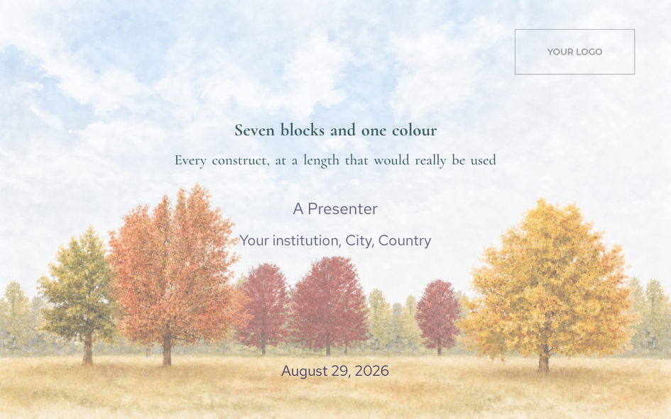
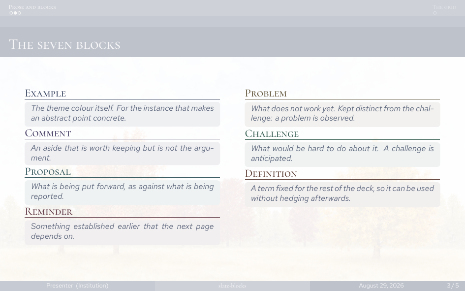
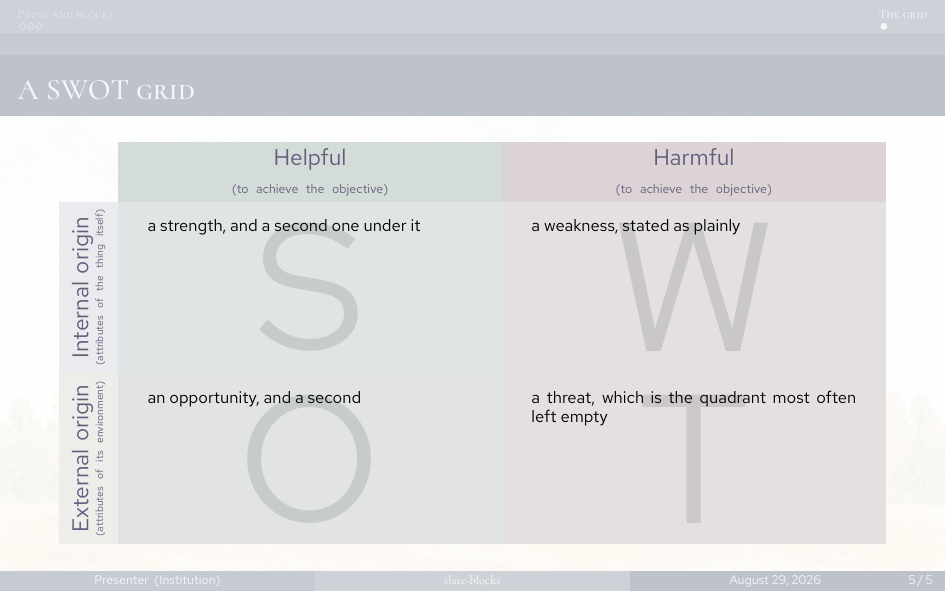

# slate-blocks

A 16:10 beamer theme in one desaturated blue-grey, with seven named blocks in
place of beamer's three, a card for section dividers, and a photographic title
page. Built on the stock Madrid / miniframes / circles themes.



**XeLaTeX only.** The fonts are OpenType and loaded by path, which means
`fontspec`.

## Quick start

Copy this directory, then:

```
./check.sh          build slides.tex, report any frame that overflows
./check.sh demo     build demo.tex — every construct, filled out
./check.sh --clean  remove build artefacts
```

Write your deck in `slides.tex`. `style.tex` holds the theme and is loaded with
`\input{style}` after `\documentclass` and the `\usetheme` lines.

Run the build **twice** — anything placed with `remember picture, overlay`
needs the previous pass's `.aux`, and that is the whole title page. `check.sh`
does this for you. On a fresh clone run it twice over: two passes hold a
settled layout but do not reach one, and the first build puts the cover's type
and photograph in the wrong place with nothing in the log to say so.

## What it gives you

| | |
|---|---|
| seven named blocks | `ExampleBox`, `CommentBox`, `ProposalBox`, `ReminderBox`, `ProblemBox`, `ChallengeBox`, `DefinitionBox` |
| `\slatedivider{EYEBROW}{Headline}{body}` | a section-divider page |
| `slatecard` environment | the same card inside a frame you open yourself — use it for a `lstlisting`, which cannot be a macro argument |
| `\swot{S}{W}{O}{T}` | a 3×3 SWOT grid |
| `\slatetitlepage` | the cover |
| `\slateWatermark{file}` | the cover photograph on every slide at 6.7% |
| `\slatecover{file}` | scales an image to cover the slide at any aspect ratio without distorting it |



Each block is a label in its own colour over a hatched rule, on a pale tint of
the same colour. Use them as environments:

```latex
\begin{ProposalBox}{A heading}
  ...
\end{ProposalBox}
```

To rename them — into another language, or to other categories — edit the
second argument in `style.tex`; nothing else depends on it:

```latex
\newcolouredblock{ExampleBox}{Example}{ThemeColor}
```



The SWOT quadrant colours are mixed from the two axes rather than picked, so a
reader can place a quadrant without reading its label. Keep each quadrant to
about four lines.

## The palette

```latex
\definecolor{ThemeColor}{RGB}{190, 194, 203}   % #bec2cb
```

Everything else derives from it by colour-wheel relations — two analogous,
three tetradic, two split-complementary — all at the same lightness and
saturation, so hue is the only thing that distinguishes them and no block
shouts louder than another.

One value covers both ends of the range: at full strength it is a background,
at `!250` (beamer's syntax for a tint past 100%, i.e. a darkening) it is the
body text.

To re-tint the deck, change the `\definecolor` and re-derive the other seven by
hand. They are written out rather than computed, because `xcolor`'s wheel
arithmetic does not survive being read back.

## The cover

`figures/background.png` is the author's own photograph. It is used full-bleed
on the title page and again at 6.7% as the watermark under every other slide.

```latex
\slateWatermark{figures/background.png}                   % in slides.tex
\renewcommand{\slateBackground}{figures/background.png}   % if the two differ
```

The five fields are `\renewcommand`s rather than arguments, so they can carry
long strings with markup:

```latex
\renewcommand{\slateTitle}{...}
\renewcommand{\slateSubTitle}{...}
\renewcommand{\slateAuthor}{...}
\renewcommand{\slateAffiliate}{...}
\renewcommand{\slateDate}{...}
```

**Replacing the photograph means re-measuring the cover.** Nothing on it is
boxed — the type sits directly on the image — so every offset in
`\slatetitlepage`, the two `!300` tints and the 6.7% watermark were chosen
against *this* picture's flat, pale areas. A new photograph moves all of them.

`figures/logo.png` is a placeholder. No institution's mark ships here: a logo
is its owner's trademark and the licence on these files does not extend to it.

## Fonts

Both are bundled in `fonts/`, under the SIL Open Font Licence, and loaded by
filename from `Path` — never by family name, which fontconfig substitutes
silently when it cannot resolve it. Which faces are bundled, and what to
re-check if you swap one, is in [`fonts/README.md`](fonts/README.md).

| | |
|---|---|
| **Red Hat Text** | everything you read a paragraph of — body, bullets, block bodies, tables, the footline |
| **Cormorant** | everything you read one line of — the cover, frame titles, block labels, the section strip |

The split is not decoration. Cormorant is a display face and goes thin at body
size; body text and the footline are the two places a deck can least afford
thin. Cormorant Medium rather than Regular even in its display role — against
a Red Hat body, Regular reads as the quieter of the two and the hierarchy
inverts.

**If you swap a face, check `smcp` and check which family the element
resolves to.** Beamer takes `frametitle` and `block title` through the **sans**
family, so a display face sitting in the roman slot never reaches them; the
`\setbeamerfont` block in `style.tex` is what redirects them. A face without
`smcp` does not raise an error — `\textsc` simply returns something that looks
nearly right. As bundled: Cormorant's upright faces carry `smcp`, accented
letters included; its italics do not, and fall back to the upright small caps,
losing the slant; Red Hat Text carries none in any face.

## Language

The language belongs to the deck, not to `style.tex`, and `babel` must come
**after** `\input{style}` — the template is what loads fontspec and picks the
faces.

```latex
\input{style}

% The LAST option is the main language.
\usepackage[english]{babel}
%\usepackage[french,english]{babel}   % mainly English, some French
%\usepackage[english,french]{babel}   % mainly French
```

`slides.tex` and `demo.tex` ship the first line active. The bilingual lines
need `babel-french`, which Overleaf and a full TeX Live have and a minimal
install does not — there they stop the build at `Unknown option 'french'`.
`babel` and `polyglossia` cannot both be loaded.

Every bundled face covers the Latin-1 accents, `œ`/`Œ`, `Ÿ` and the guillemets,
and small caps reach the accented letters. A language package does not touch
the fonts: `fontspec` chooses faces by path, `babel` chooses hyphenation and
spacing.

French inserts a thin space before `:` `;` `!` `?` inside `\texttt` and
`lstlisting` as well, which is wrong in a URL, a path or a query string. Check
any verbatim material containing a colon.

## Troubleshooting

**The cover is blank, or its type is out of place.** One pass. Build twice —
three times on a fresh clone or after moving anything on the title page.

**`\newtheorem` fails: command already defined.** `\Example`, `\Definition` and
several others are taken by amsmath and by beamer's own theorem set. Every
block name here carries a `Box` suffix for that reason.

**`Illegal parameter number in definition of \beamer@doifinframe`.** A
`\newcommand` that takes an argument, defined inside a frame. Beamer reads a
frame body twice. Define it in the preamble.

**Small caps come out as ordinary letters.** The element is resolving to a
family without `smcp` — see *Fonts* above.

**A SWOT axis label is missing its second line.** The rotated labels are
`\parbox`es sized to three lines. A wider body font makes the axis name wrap
too, and the fourth line is not overflowed onto the page, it is simply absent
from the render with nothing in the log. The box is at 2.7cm; measuring the
string in a standalone document under-reports. After changing a font, look at
the SWOT page.

**A frame overflows.** `./check.sh` names it. Cut it or split it — do not reach
for `[shrink]`, which scales the content down to fit and is the behaviour this
template exists to refuse.

## Files

```
style.tex     the theme
slides.tex    your deck
demo.tex      every construct, filled out
check.sh      build twice, report overflows
fonts/        Red Hat Text, Cormorant, and their licences
figures/      the cover photograph and a placeholder logo
```

## Licence

See [LICENSE](LICENSE). The template and the cover photograph are CC BY 4.0;
the two fonts are under the SIL Open Font Licence, which is not CC BY and does
not merge into it — keep `OFL.txt` with the font files, including inside any
zip you redistribute.
